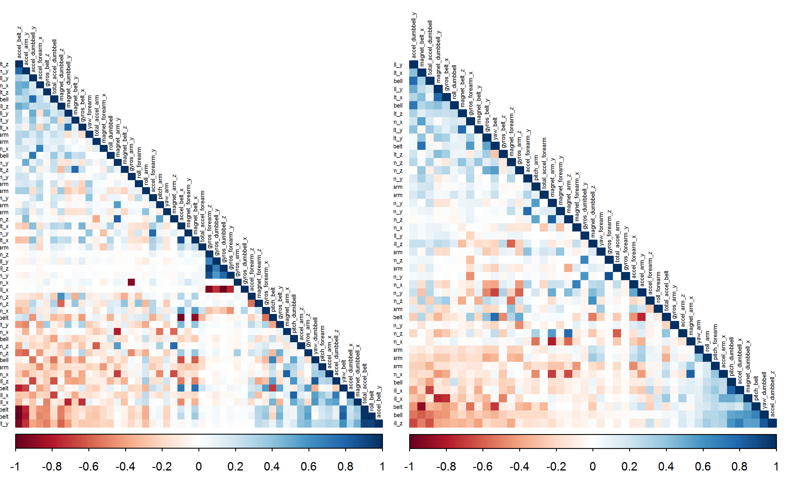
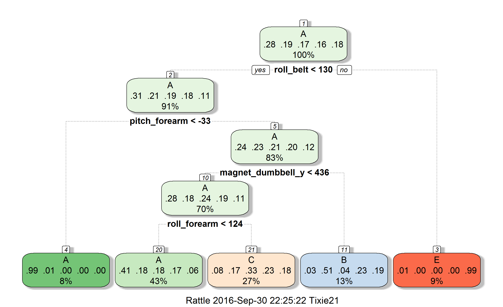
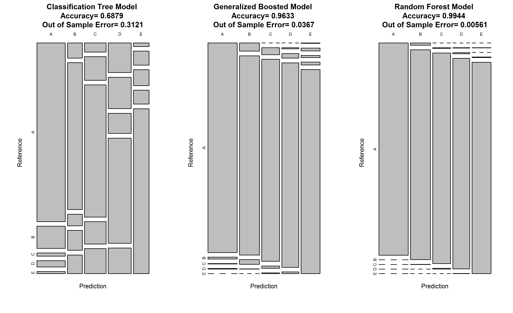
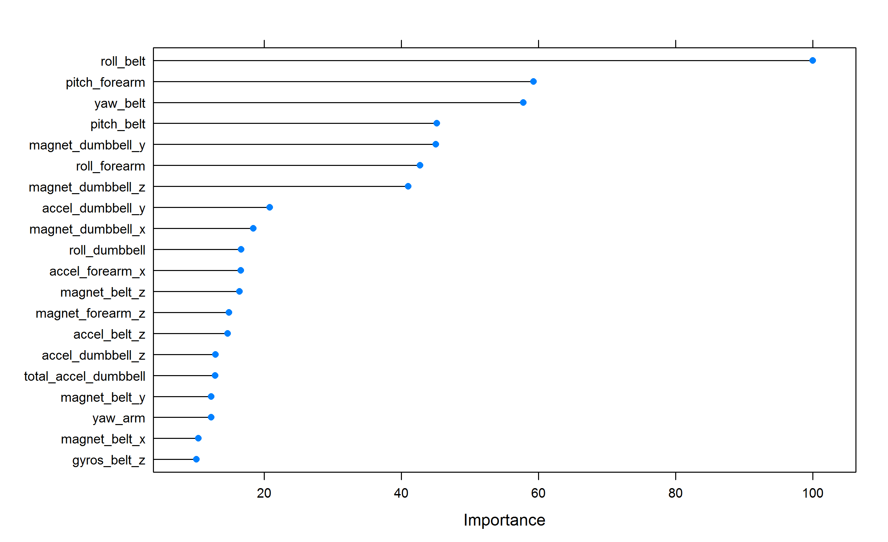

#**Predictive Machine Learning Project **    
### *Predictive Analysis of the Quality of Weight Lifting Exercises*  
<p></br></p>

####**Tihana Mirkovic**
###### September 28, 2016  

<p></br></p>


##**1 Introduction (Synopsis)**

Owing to the advancements in wearable technology for the tracking of personal activity, such as Jawbone Up, Nike FuelBand, and Fitbit, a large amount of data on physical performance is easily collected. The primary goal of these devices is to allow customers to quantify self movement, but often, the quality of the exercise performance gets neglected. In this project, data collected from 6 individuals while performing barbell lifts from accelerometers on the belt, forearm, arm, as well as the dumbbell itself, is used in order to build a predictive model for the classification of how well the weightlifting exercise was performed. 

The quality of the execution of the weightlifting exercise was defined in five different categories:  

*  **CLASS A**: exactly according to the specification  
*  **CLASS B**: throwing the elbows to the front  
*  **CLASS C**: lifting the dumbbell only halfway
*  **CLASS D**: lowering the dumbbell only halfway
*  **CLASS E**: throwing the hips to the front

A [training data set](https://d396qusza40orc.cloudfront.net/predmachlearn/pml-training.csv) and a [test data set](https://d396qusza40orc.cloudfront.net/predmachlearn/pml-testing.csv) have been obtained from the [course project website](https://www.coursera.org/learn/practical-machine-learning/peer/R43St/prediction-assignment-writeup) with further information provided on the original [source website](http://groupware.les.inf.puc-rio.br/har).

The machine learning algorithm developed in this project is outlined below. The classification tree approach, the generalized boosted model, the random forest classification were compared and assessed for accuracy. Consequently the most accurate model, in this case the random forest classification, was applied to the test data set in order to obtain predictions in which manner the exercises were performed in (class A to E).

<p></br></p>


##**2 Data Processing**


####**2.1 R Document Set Up**

- The necessary libraries for the analysis and graphing were loaded.
- Also, `echo = TRUE` has been selected for all the code chunks, so that they are visible to reviewers.


```r
library(knitr)
opts_chunk$set(echo = TRUE)
knitr::opts_chunk$set(dev="png", dpi=300)
library(caret)
library(randomForest)
library(lattice)
library(ggplot2)
library(gbm)
library(rpart)
library(MASS)
library(plyr)
library(corrplot)
library(rattle)
library(rpart.plot)
library(htmlTable)
library(gridExtra)
library(cowplot)
set.seed(1234)
```
<p></br></p>

####**2.2 Downloading the Data**  

First, the two data sets, the training and the test data set, were downloaded from the course website, and subsequently `read.csv` was used to read them in. 

```r
##downloading training data set
if(!file.exists("./pml_data_training.csv")){
download.file("https://d396qusza40orc.cloudfront.net/predmachlearn/pml-training.csv", destfile="./pml_data_training.csv")
}
training_all<-read.csv("pml_data_training.csv", na.strings=c('#DIV/0', '', 'NA') ,stringsAsFactors = F, header = TRUE)


##downloading testing data set
if(!file.exists("./pml_data_testing.csv")){
download.file("https://d396qusza40orc.cloudfront.net/predmachlearn/pml-testing.csv", destfile="./pml_data_testing.csv")
}
testing_all<-read.csv("pml_data_testing.csv",na.strings=c('#DIV/0', '', 'NA') ,stringsAsFactors = F, header = TRUE)
```
<p></br></p>

####**2.2 Initial Data Check**  

The dimensions of the two sets are checked, and the names of the columns compared. Only the last column, `classe` in the training set, and `problem_id` in the test set, have different names.

```r
##checking dimensions
dim(training_all)
```

```
## [1] 19622   160
```

```r
dim(testing_all)
```

```
## [1]  20 160
```

```r
##checking if all the columns are named the same
names(training_all) %in% names(testing_all)
```

```
##   [1]  TRUE  TRUE  TRUE  TRUE  TRUE  TRUE  TRUE  TRUE  TRUE  TRUE  TRUE
##  [12]  TRUE  TRUE  TRUE  TRUE  TRUE  TRUE  TRUE  TRUE  TRUE  TRUE  TRUE
##  [23]  TRUE  TRUE  TRUE  TRUE  TRUE  TRUE  TRUE  TRUE  TRUE  TRUE  TRUE
##  [34]  TRUE  TRUE  TRUE  TRUE  TRUE  TRUE  TRUE  TRUE  TRUE  TRUE  TRUE
##  [45]  TRUE  TRUE  TRUE  TRUE  TRUE  TRUE  TRUE  TRUE  TRUE  TRUE  TRUE
##  [56]  TRUE  TRUE  TRUE  TRUE  TRUE  TRUE  TRUE  TRUE  TRUE  TRUE  TRUE
##  [67]  TRUE  TRUE  TRUE  TRUE  TRUE  TRUE  TRUE  TRUE  TRUE  TRUE  TRUE
##  [78]  TRUE  TRUE  TRUE  TRUE  TRUE  TRUE  TRUE  TRUE  TRUE  TRUE  TRUE
##  [89]  TRUE  TRUE  TRUE  TRUE  TRUE  TRUE  TRUE  TRUE  TRUE  TRUE  TRUE
## [100]  TRUE  TRUE  TRUE  TRUE  TRUE  TRUE  TRUE  TRUE  TRUE  TRUE  TRUE
## [111]  TRUE  TRUE  TRUE  TRUE  TRUE  TRUE  TRUE  TRUE  TRUE  TRUE  TRUE
## [122]  TRUE  TRUE  TRUE  TRUE  TRUE  TRUE  TRUE  TRUE  TRUE  TRUE  TRUE
## [133]  TRUE  TRUE  TRUE  TRUE  TRUE  TRUE  TRUE  TRUE  TRUE  TRUE  TRUE
## [144]  TRUE  TRUE  TRUE  TRUE  TRUE  TRUE  TRUE  TRUE  TRUE  TRUE  TRUE
## [155]  TRUE  TRUE  TRUE  TRUE  TRUE FALSE
```

```r
##the names of the two columns that differ in the training/test sets
names(training_all[160])
```

```
## [1] "classe"
```

```r
names(testing_all[160])
```

```
## [1] "problem_id"
```

<p></br></p>

####**2.3 Data Cleaning**  

A number of columns contain a large number missing values. The number of NA occurrences for each column is determined, and the names of those with above 19000 NA values have been selected to be removed from the data sets. 

```r
##counting NAs in each column and finding the names of those columns
na_count <-sapply(training_all, function(y) sum(length(which(is.na(y)))))
na_columns<-subset(na_count, na_count>19000)
names_na_columns<-names(na_columns)
```
<p></br></p>


Then, the NA columns, as well as the first seven columns, which don't serve as predictor variables are removed from the data set, for both, the `testing_all` and the `training_all` data sets, creating the `training_1` and the `testing_1` data sets . In the case of the training data set, the `classe` variable is reset to `factor` using the `as.factor` function. The `dim` function confirms that the new data sets contain 53 columns (52 predictors and `classe`/`problem_id`) and 19622 rows for the training and 20 rows for the testing data set. 

```r
training_2 <- training_all[, -c(1:7)]
training_1<- training_2[, -which(names(training_2)%in%names_na_columns)]
training_1$classe<-as.factor(training_1$classe)


testing_2 <- testing_all[, -c(1:7)]
testing_1<-testing_2[, -which(names(training_2)%in%names_na_columns)]

dim(training_1)
```

```
## [1] 19622    53
```

```r
dim(testing_1)
```

```
## [1] 20 53
```
<p></br></p>


####**2.4 Data Splitting** 

The testing data set will be used for the final run, so we need to split the cleaned `training_1` data set into a new `training` (70%) and `validation` (30%) data set. The `validation` data set will be used to test the out-of-sample error.

```r
set.seed(1234)
inTrain<-createDataPartition(training_1$classe, p=0.7, list=FALSE)
training<-training_1[inTrain,]
validation<-training_1[-inTrain,]

dim(training)
```

```
## [1] 13737    53
```

```r
dim(validation)
```

```
## [1] 5885   53
```
<p></br></p>

##**3 Model Creation**


####**3.1 Variable Selection - Correlation Analysis**
There are 52 predictor variables, and the correlation was checked to see if there are any that are highly correlated variables (with a cut off set at 0.9) which would allow us to reduce their number in the predictive model. A smaller training set was then produced, taking out the highly correlated variables and creating `training_small`, with a total of 46 columns. Similar reduction in data sets was then also performed for the `validation` and `test` data sets. 

```r
correlationMatrix<-cor(training[,1:52])
highlyCorrelated <- findCorrelation(correlationMatrix, cutoff=0.90)

training_small<-training[,-highlyCorrelated]
validation_small<-validation[,-highlyCorrelated]
test_small<-testing_1[,-highlyCorrelated]

dim(training_small)
```

```
## [1] 13737    46
```

A correlation matrix is plotted to better visualize the correlated variables, as well as the changes upon removing some of them to create the `training_small` data set. 

```r
correlationMatrix_small<-cor(training_small[,-46])

par(mfrow = c(1, 2))

##correlation Matrix for the original clean training set
corrplot(correlationMatrix, type="lower", order="FPC", method="color", tl.cex = 0.4, tl.col = "black")

##correlation Matrix for the smaller training set with some of the highly correlated variables removed       
corrplot(correlationMatrix_small, type="lower", order="FPC", method="color", tl.cex = 0.4, tl.col = "black")
```

<!-- -->

**Figure 1**   The correlation matrix of the  clean training set, `training` (left), and the correlation matrix `training_small` produced after the removal of the seven variables that were found to have a high correlation (right). The variables that are highly correlated are shown in the dark hues of blue and red. 

<p></br></p>

####**3.2 Variable Selection - Principle Component Analysis**
In the previous section we identified a few highly correlated variables, but an additional preprocessing step can be performed by doing the Principal Component Analysis (PCA), which could further decrease the number of components needed. 


```r
preProc_training<-preProcess(training[,-53], method="pca", thresh=0.95)
preProc_training
```

```
## Created from 13737 samples and 52 variables
## 
## Pre-processing:
##   - centered (52)
##   - ignored (0)
##   - principal component signal extraction (52)
##   - scaled (52)
## 
## PCA needed 25 components to capture 95 percent of the variance
```

```r
training_pca<-predict(preProc_training,training[,-53])
dim(training_pca)
```

```
## [1] 13737    25
```
Above, we can see that PCA has yielded a set of 25 components, substantially reducing the original number of predictor variables from 52, that are able to capture 95% of the variance of the data set. 
<p></br></p>

####**3.3 Data Set Summary and Selection**

Below, in **Table 1**, all the different data sets which have been created so far are summarized in order to help us determine the data sets we are going to use in our model development.

```r
##Creating a table with all the data set information
data_set<-c("training", "training_small", "training_pca", "validation", "validation_small", "testing_1")
dimensions<-c("13737 x 53", "13737 x 46","13737 x 25","5885 x 53","5885 x 46","20 x 53")
origin<-c("partitioned training set without NAs", "from `training` without highly correlated variables",
          "PCA performed on `training`","from partitioned training set without NAs",
          "from `validation` withouth highly correlated variables",
          "cleaned testing set matching `training`")
Tab_data_sets = as.table(cbind(data_set, dimensions, origin))

htmlTable(Tab_data_sets, align="l|l|l|", rnames=c("", "", "", "", "", ""), caption="**Table 1 ** Summary of the data sets and their respective dimensions")
```

<table class='gmisc_table' style='border-collapse: collapse; margin-top: 1em; margin-bottom: 1em;' >
<thead>
<tr><td colspan='4' style='text-align: left;'>
**Table 1 ** Summary of the data sets and their respective dimensions</td></tr>
<tr>
<th style='border-bottom: 1px solid grey; border-top: 2px solid grey;'> </th>
<th style='border-bottom: 1px solid grey; border-top: 2px solid grey; text-align: center;'>data_set</th>
<th style='border-bottom: 1px solid grey; border-top: 2px solid grey; text-align: center;'>dimensions</th>
<th style='border-bottom: 1px solid grey; border-top: 2px solid grey; text-align: center;'>origin</th>
</tr>
</thead>
<tbody>
<tr>
<td style='text-align: left;'></td>
<td style='border-right: 1px solid black; text-align: left;'>training</td>
<td style='border-right: 1px solid black; text-align: left;'>13737 x 53</td>
<td style='border-right: 1px solid black; text-align: left;'>partitioned training set without NAs</td>
</tr>
<tr>
<td style='text-align: left;'></td>
<td style='border-right: 1px solid black; text-align: left;'>training_small</td>
<td style='border-right: 1px solid black; text-align: left;'>13737 x 46</td>
<td style='border-right: 1px solid black; text-align: left;'>from `training` without highly correlated variables</td>
</tr>
<tr>
<td style='text-align: left;'></td>
<td style='border-right: 1px solid black; text-align: left;'>training_pca</td>
<td style='border-right: 1px solid black; text-align: left;'>13737 x 25</td>
<td style='border-right: 1px solid black; text-align: left;'>PCA performed on `training`</td>
</tr>
<tr>
<td style='text-align: left;'></td>
<td style='border-right: 1px solid black; text-align: left;'>validation</td>
<td style='border-right: 1px solid black; text-align: left;'>5885 x 53</td>
<td style='border-right: 1px solid black; text-align: left;'>from partitioned training set without NAs</td>
</tr>
<tr>
<td style='text-align: left;'></td>
<td style='border-right: 1px solid black; text-align: left;'>validation_small</td>
<td style='border-right: 1px solid black; text-align: left;'>5885 x 46</td>
<td style='border-right: 1px solid black; text-align: left;'>from `validation` withouth highly correlated variables</td>
</tr>
<tr>
<td style='border-bottom: 2px solid grey; text-align: left;'></td>
<td style='border-bottom: 2px solid grey; border-right: 1px solid black; text-align: left;'>testing_1</td>
<td style='border-bottom: 2px solid grey; border-right: 1px solid black; text-align: left;'>20 x 53</td>
<td style='border-bottom: 2px solid grey; border-right: 1px solid black; text-align: left;'>cleaned testing set matching `training`</td>
</tr>
</tbody>
</table>
  
<p></br></p>
The advantages of using the `training_pca` set would be that it is more compact and would allow for a faster analysis, but the disadvantage is that the predictor variables used in the training set derived through PCA are not easily interpretable.   

Here, as the number of variables in the `training` data set is still manageable. We will continue with that data set, in order to relate the results to the physical concepts of the experiment. If prediction and calculation time were the only factors to consider, then the reduced `training_pca` data set can be used. 

Performing the modelling with the `training_small` set was also done as a check (not shown here because of assignment length requirements), and no noticeable differences were observed compared to the `training` set.
<p></br></p>

####**3.4 Model Selection: Classification Tree**

A classification tree approach was used on the `training` data set and the developed model was subsequently applied on the `validation` set to check the model accuracy. 

```r
set.seed(1234)
modFit_tree<-train(classe~., method="rpart", data=training)
print(modFit_tree$finalModel)
```

```
## n= 13737 
## 
## node), split, n, loss, yval, (yprob)
##       * denotes terminal node
## 
##  1) root 13737 9831 A (0.28 0.19 0.17 0.16 0.18)  
##    2) roll_belt< 130.5 12563 8667 A (0.31 0.21 0.19 0.18 0.11)  
##      4) pitch_forearm< -33.05 1111   14 A (0.99 0.013 0 0 0) *
##      5) pitch_forearm>=-33.05 11452 8653 A (0.24 0.23 0.21 0.2 0.12)  
##       10) magnet_dumbbell_y< 436.5 9625 6886 A (0.28 0.18 0.24 0.19 0.11)  
##         20) roll_forearm< 123.5 5965 3517 A (0.41 0.18 0.18 0.17 0.059) *
##         21) roll_forearm>=123.5 3660 2435 C (0.08 0.17 0.33 0.23 0.18) *
##       11) magnet_dumbbell_y>=436.5 1827  904 B (0.033 0.51 0.043 0.23 0.19) *
##    3) roll_belt>=130.5 1174   10 E (0.0085 0 0 0 0.99) *
```

```r
modFit_tree_2 <- rpart(classe~., data=training, method="class")
```


```r
fancyRpartPlot(modFit_tree$finalModel)
```

<!-- -->
**Figure 2**   A Classification Tree dendrogram.
<p></br></p>
<p></br></p>
Below, the accuracy of the classification tree approach is calculated on the predictions of the `validation` data set, and with 0.6879 accuracy, it is proven not to be good enough model for our prediction analysis. 

```r
##testing the Classification tree model
predictions_tree<-predict(modFit_tree_2, validation, type="class")
C_Matrix_tree<-confusionMatrix(predictions_tree, validation$classe)
C_Matrix_tree
```

```
## Confusion Matrix and Statistics
## 
##           Reference
## Prediction    A    B    C    D    E
##          A 1364  169   24   48   16
##          B   60  581   46   79   74
##          C   52  137  765  129  145
##          D  183  194  125  650  159
##          E   15   58   66   58  688
## 
## Overall Statistics
##                                           
##                Accuracy : 0.6879          
##                  95% CI : (0.6758, 0.6997)
##     No Information Rate : 0.2845          
##     P-Value [Acc > NIR] : < 2.2e-16       
##                                           
##                   Kappa : 0.6066          
##  Mcnemar's Test P-Value : < 2.2e-16       
## 
## Statistics by Class:
## 
##                      Class: A Class: B Class: C Class: D Class: E
## Sensitivity            0.8148  0.51010   0.7456   0.6743   0.6359
## Specificity            0.9390  0.94543   0.9047   0.8657   0.9590
## Pos Pred Value         0.8415  0.69167   0.6230   0.4958   0.7774
## Neg Pred Value         0.9273  0.88940   0.9440   0.9314   0.9212
## Prevalence             0.2845  0.19354   0.1743   0.1638   0.1839
## Detection Rate         0.2318  0.09873   0.1300   0.1105   0.1169
## Detection Prevalence   0.2754  0.14274   0.2087   0.2228   0.1504
## Balanced Accuracy      0.8769  0.72776   0.8252   0.7700   0.7974
```

<p></br></p>


####**3.5 Model Selection: Generalized Boosted Model**

Then the Generalized Boosted Model was applied to the `training` and `validation` data sets. Here, we use a 3-fold cross validation due to the high computational time. 

```r
set.seed(1234)
control_gbm<-trainControl(method='cv', number=3) #k-fold Cross validation
modFit_gbm<-train(classe~., method="gbm", data=training, trControl=control_gbm, verbose=FALSE)
modFit_gbm$finalModel
```

```
## A gradient boosted model with multinomial loss function.
## 150 iterations were performed.
## There were 52 predictors of which 44 had non-zero influence.
```


```r
##testing the gbm model
predictions_gbm<-predict(modFit_gbm, newdata=validation)
C_Matrix_gbm<-confusionMatrix(validation$classe,predict(modFit_gbm, validation))
C_Matrix_gbm
```

```
## Confusion Matrix and Statistics
## 
##           Reference
## Prediction    A    B    C    D    E
##          A 1653   14    3    4    0
##          B   44 1069   25    1    0
##          C    0   34  977   11    4
##          D    0    6   21  929    8
##          E    2   15   10   14 1041
## 
## Overall Statistics
##                                          
##                Accuracy : 0.9633         
##                  95% CI : (0.9582, 0.968)
##     No Information Rate : 0.2887         
##     P-Value [Acc > NIR] : < 2.2e-16      
##                                          
##                   Kappa : 0.9535         
##  Mcnemar's Test P-Value : 1.246e-07      
## 
## Statistics by Class:
## 
##                      Class: A Class: B Class: C Class: D Class: E
## Sensitivity            0.9729   0.9394   0.9431   0.9687   0.9886
## Specificity            0.9950   0.9853   0.9899   0.9929   0.9915
## Pos Pred Value         0.9875   0.9385   0.9522   0.9637   0.9621
## Neg Pred Value         0.9891   0.9855   0.9879   0.9939   0.9975
## Prevalence             0.2887   0.1934   0.1760   0.1630   0.1789
## Detection Rate         0.2809   0.1816   0.1660   0.1579   0.1769
## Detection Prevalence   0.2845   0.1935   0.1743   0.1638   0.1839
## Balanced Accuracy      0.9840   0.9623   0.9665   0.9808   0.9901
```
<p></br></p>
The GBM model has achieved a 96.33% accuracy rate on the prediction for the `validation` set. 

<p></br></p>
####**3.6 Model Selection: Random Forest**

Then, the Random forest approach was applied to the `training` and `validation` data sets. Here, we use a 5-fold cross validation due to the high computational time. 

```r
set.seed(1234)
control_rf<-trainControl(method="cv", 5) #k-fold Cross validation
modFit_rf<-train(classe~., method="rf", data=training, trControl=control_rf, ntree=200)
```


```r
##testing the random forest model
predictions_rf<-predict(modFit_rf, newdata=validation)
C_Matrix_rf<-confusionMatrix(validation$classe,predict(modFit_rf, validation))
C_Matrix_rf
```

```
## Confusion Matrix and Statistics
## 
##           Reference
## Prediction    A    B    C    D    E
##          A 1674    0    0    0    0
##          B   12 1126    1    0    0
##          C    0    4 1018    4    0
##          D    0    2    5  956    1
##          E    0    1    0    3 1078
## 
## Overall Statistics
##                                           
##                Accuracy : 0.9944          
##                  95% CI : (0.9921, 0.9961)
##     No Information Rate : 0.2865          
##     P-Value [Acc > NIR] : < 2.2e-16       
##                                           
##                   Kappa : 0.9929          
##  Mcnemar's Test P-Value : NA              
## 
## Statistics by Class:
## 
##                      Class: A Class: B Class: C Class: D Class: E
## Sensitivity            0.9929   0.9938   0.9941   0.9927   0.9991
## Specificity            1.0000   0.9973   0.9984   0.9984   0.9992
## Pos Pred Value         1.0000   0.9886   0.9922   0.9917   0.9963
## Neg Pred Value         0.9972   0.9985   0.9988   0.9986   0.9998
## Prevalence             0.2865   0.1925   0.1740   0.1636   0.1833
## Detection Rate         0.2845   0.1913   0.1730   0.1624   0.1832
## Detection Prevalence   0.2845   0.1935   0.1743   0.1638   0.1839
## Balanced Accuracy      0.9964   0.9955   0.9962   0.9956   0.9991
```


<p></br></p>
####**3.7 Final Model Selection and Out-of-Sample Error**
Out of the three models that were investigated, the random forest model showed the highest accuracy, as depicted in **Figure 3**. 


```r
layout(t(1:3))
plot(C_Matrix_tree$table, col="grey", main =paste("Classification Tree Model \nAccuracy=", round(C_Matrix_tree$overall['Accuracy'],4),"\nOut of Sample Error=",1-round(C_Matrix_tree$overall['Accuracy'],4)))

plot(C_Matrix_gbm$table, col="grey", main =paste("Generalized Boosted Model \nAccuracy=", round(C_Matrix_gbm$overall['Accuracy'],4),"\nOut of Sample Error=",1-round(C_Matrix_gbm$overall['Accuracy'],4)))

plot(C_Matrix_rf$table, col="grey", main =paste("Random Forest Model \nAccuracy=", round(C_Matrix_rf$overall['Accuracy'],4),"\nOut of Sample Error=",1-round(C_Matrix_rf$overall['Accuracy'],5)))
```

<!-- -->
**Figure 3**   The tables of the confusion matrices illustrate the accuracies of the three models that were investigated: **Classification Tree** (left), **Generalized Boosted Model** (centre), **Random Forest** (right). 
<p></br></p>

The random forest model will be the selected model with which the predictions on the test data set will be performed. **Figure 4** illustrates the factors with the highest importance in the random forest model. 

```r
v_imp<-varImp(modFit_rf)
plot(v_imp, top=20)
```

<!-- -->
**Figure 4**   A depiction of the top 20 variables in the random forest model. 


<p></br></p>

##**4 Prediction on Test Data Set**
By applying the random forest model, the following predictions were made for the exercise categories of the test data set:


```r
predictions_rf_test<-predict(modFit_rf, newdata=testing_1)
predictions_rf_test
```

```
##  [1] B A B A A E D B A A B C B A E E A B B B
## Levels: A B C D E
```
<p></br></p>


##**5 Conclusion**

An accurate prediction model was built for the classification of the quality of barbell lifts based on the variables collected from a number of accelerometers monitored during the exercise. In this study, the Classification Tree, the Generalized Boosted Model approach, and the Random Forest classification technique were explored, and it was found that the Random Forest Classification technique with a 5-fold cross validation, performed the best, with and an accuracy of 0.9944 and an out-of-sample error estimated at 0.0056. Consequently it was selected as the model that was used on the test data to predict the exercise classification. 

In the data cleaning and model building process, the training set size was explored. In the initial step the original data set was cleaned by removing columns with missing values. Also, alternative training sets were formed by either removing the top 7 highly correlated factors, or performing Principle Component Analysis, which reduced the required number of parameters even further. The smaller training data sets would be desirable if one considers calculation time to be an issue, as random forest requires a substantial amount of computing time. Here, the training set with 52 predictor variables was used, and variable importance evaluation in the different models has confirmed that `roll_belt`, and `pitch_forearm` tend to rank the highest.   


